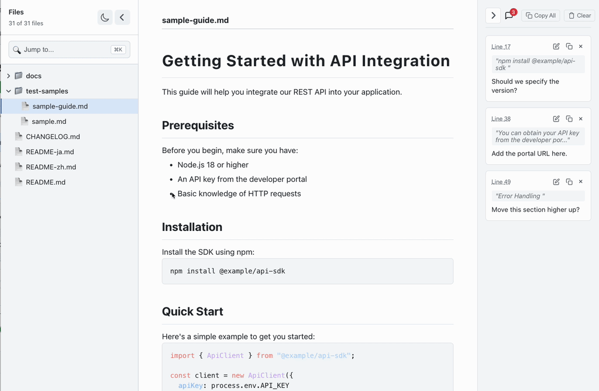

# md-review

[English](./README.md) | [日本語](./README-ja.md) | 简体中文



用于预览 Markdown 文件并添加注释的 CLI 工具。
注释可以复制并用作 AI 代理的反馈。

## Features

- 以原始格式显示 Markdown 和 MDX
- 解析并显示 Frontmatter 元数据
- 为特定行添加注释
- 编辑现有注释
- 从树视图中选择文件
- 支持深色模式（跟随系统设置）
- 支持调整和折叠侧边栏
- 点击注释中的行号跳转到相应内容
- Markdown 文件更改时自动重新加载

## Install

```sh
npm install -g md-review
```

## Usage

```sh
md-review [options]              # 预览当前目录中的所有 Markdown 文件
md-review <file> [options]       # 预览特定的 Markdown 文件 (.md, .markdown, .mdx)
md-review <directory> [options]  # 预览特定目录中的 Markdown 文件
```

### Options

```sh
-p, --port <port>     # 服务器端口 (默认: 3030)
    --no-open         # 不自动打开浏览器
-h, --help            # 显示帮助信息
-v, --version         # 显示版本号
```

### Examples

```sh
md-review                        # 预览当前目录中的所有 Markdown 文件
md-review docs                   # 预览 docs 目录中的 Markdown 文件
md-review README.md              # 预览 README.md
md-review docs/guide.mdx         # 预览 MDX 文件
md-review docs/guide.md --port 8080
```

## 注释管理

### 添加注释

1. 在 Markdown 预览中选择文本
2. 点击出现的 "Comment" 按钮
3. 输入注释并按 `Cmd/Ctrl+Enter` 或点击 "Submit"

### 编辑注释

1. 点击任何现有注释上的编辑图标（铅笔）
2. 在文本区域中修改文本
3. 按 `Cmd/Ctrl+Enter` 或点击 "Save" 保存更改
4. 按 `Escape` 或点击 "Cancel" 放弃更改

### 键盘快捷键

- `Cmd/Ctrl+Enter` - 提交/保存注释
- `Escape` - 取消编辑
- `Cmd+K` - 聚焦搜索栏（目录模式）

## 自动重新加载

md-review 自动监视 Markdown 文件的更改：

- 当您编辑并保存 Markdown 文件时，预览会自动更新
- 无需手动刷新浏览器
- 在单文件和目录浏览模式下均可工作
- 文件监视使用高效的 Server-Sent Events (SSE)

这使其非常适合实时编辑工作流和文档的快速迭代。

## License

[MIT](./LICENSE)
