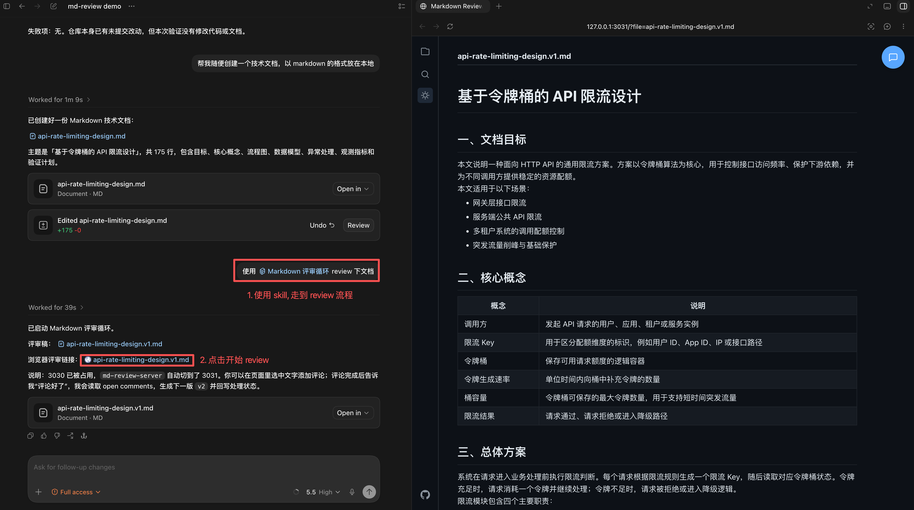
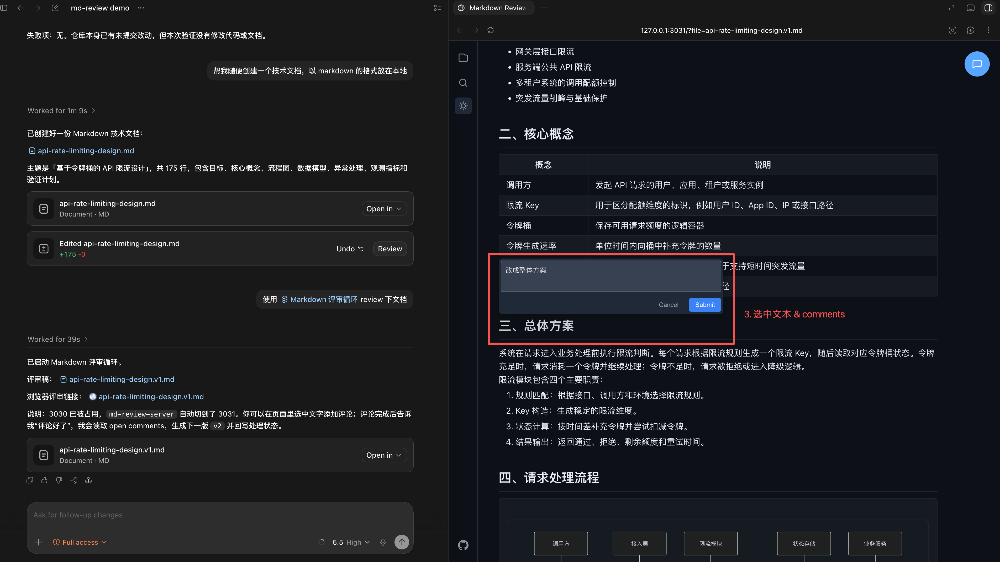
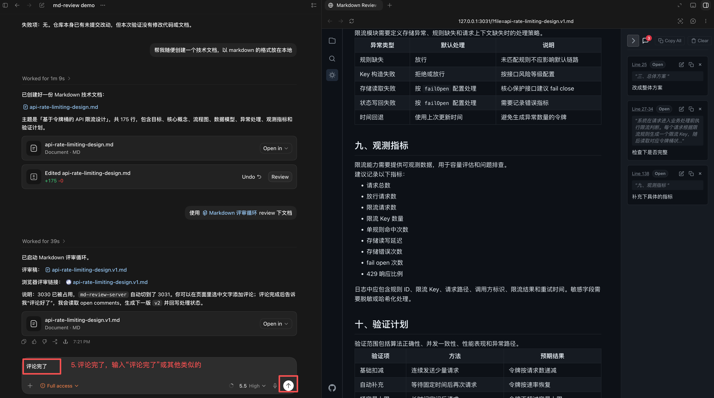
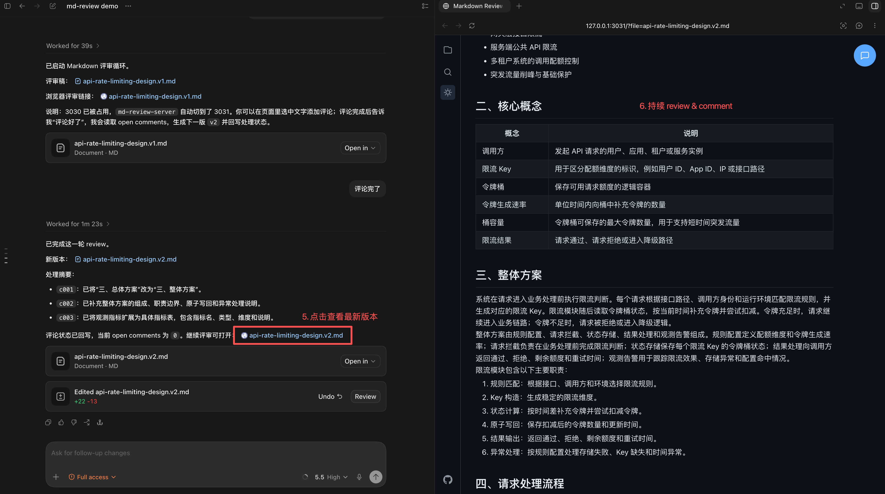
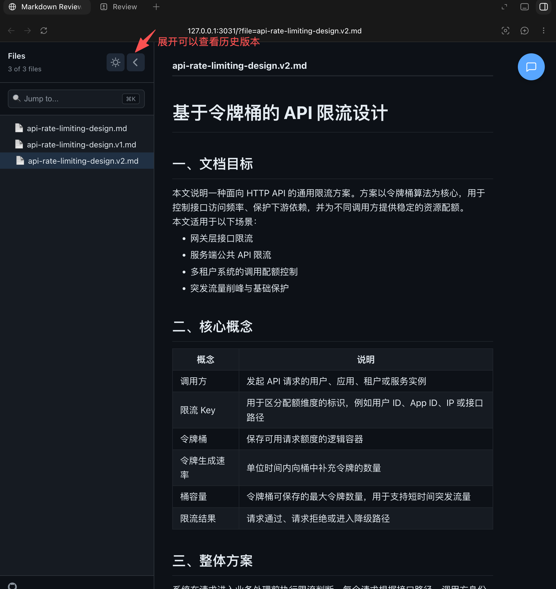

# md-review-server

[](https://www.npmjs.com/package/md-review-server)
[](./LICENSE)
[](https://github.com/tracyxiong1/md-review-server)

`md-review-server` 是面向 Codex 的本地 Markdown 可视化评审工具。

在 Codex 中，纯对话适合提出整体修改要求，但不方便圈选长文中的具体内容并集中提交评论。`md-review-server` 提供浏览器预览、选区批注、评论状态跟踪和 `markdown-review-loop` skill，用于搭建“批注 -> 修订 -> 再评审”的 Markdown 协作流程。

## 使用场景

- 评审技术方案、README、机制说明、复盘草稿等 Markdown 文档。
- 在浏览器中圈选具体文本，留下局部修改意见。
- 让 Codex 读取评论、生成下一版文档，并继续下一轮评审。

## 快速开始

### 安装 skill

推荐让 Codex 自动安装：

```text
帮我安装 skill：https://www.npmjs.com/package/md-review-server
```

也可以手动安装：

```sh
npx -y md-review-server@latest skill install
npx -y md-review-server@latest skill doctor
```

### 启动评审

在 Codex 中输入：

```text
使用 $markdown-review-loop 帮我启动 docs/example.md 的评审循环。
```

Codex 会打开本地评审页面。用户在浏览器中圈选文本并创建评论。

### 生成下一版

评论完成后，回到 Codex 输入：

```text
评论完了，读取评论并生成下一版。
```

Codex 会根据评论生成新版本，例如：

```text
example.v1.md -> example.v2.md
```

如果还需要继续修改，在新版文档上补充评论，然后对 Codex 说：

```text
我已经在新版上补充了评论，继续处理。
```

## 示意流程

### 1. 进入评审流程



### 2. 在浏览器中阅读和圈选



### 3. 提交局部评论


### 4. 回到 Codex 处理评论



### 5. 查看结果并进入下一轮



历史版本可以在文件树中切换查看：



## 手动启动 Review Server

不使用 Codex skill 时，可以直接启动本地服务：

```sh
npx -y md-review-server@latest docs --port 3030 --active-file docs/guide.md
```

也可以全局安装：

```sh
npm install -g md-review-server
md-review-server docs --port 3030
```

默认只监听 `127.0.0.1`。如果使用 `--host 0.0.0.0`，服务会在启动时输出安全提示。

## 主要能力

- 内置 `markdown-review-loop` Codex skill，支持 npm 安装和更新。
- 在浏览器中预览 Markdown / MDX，并对选中文本创建评论。
- 将评论持久化到 `.reviews/*.review.json`，刷新后继续保留。
- 提供 HTTP API，供 Codex 读取 open comments 并回写处理状态。
- 支持目录模式、文件树、版本化 Markdown 文件和深色模式。
- 支持评论编辑、删除、状态展示和对应内容跳转。

## CLI 使用方式

```sh
md-review-server [options]              # 浏览当前目录下的 Markdown 文件
md-review-server <file> [options]       # 预览单个 Markdown 文件
md-review-server <directory> [options]  # 浏览指定目录下的 Markdown 文件
```

### 参数

```sh
-p, --port <port>           服务端口，默认 3030
    --host <host>           监听地址，默认 127.0.0.1
    --review-dir <dir>      review sidecar 目录，默认 .reviews
    --active-file <file>    目录模式下初始选中的文件
    --readonly              禁用评论写入 API
    --no-open               不自动打开浏览器
    skill <command>         安装、更新或检查内置 Codex skills
-h, --help                  显示帮助信息
-v, --version               显示版本号
```

## 进阶说明

### 技术方案

体验升级和后续实现计划见 [Codex Review Workbench 体验升级技术方案](./docs/codex-review-workbench-tech-design.md)。

### 评论数据

评论由服务端写入 Markdown 所在的 review 目录：

```text
docs/.reviews/guide.v2.review.json
```

支持的评论状态：

- `open`
- `resolved`
- `partially_resolved`
- `unresolved`
- `ignored`

### HTTP API

| Method | Path                | 用途                            |
| ------ | ------------------- | ------------------------------- |
| GET    | `/api/session`      | 获取当前 review server 会话信息 |
| GET    | `/api/comments`     | 按文件和状态读取评论            |
| POST   | `/api/comments`     | 创建评论                        |
| PATCH  | `/api/comments/:id` | 更新单条评论内容或状态          |
| PATCH  | `/api/comments`     | 批量回写评论状态                |
| DELETE | `/api/comments/:id` | 删除评论                        |

## 本地开发

```sh
pnpm install
pnpm dev
pnpm test
pnpm build
pnpm lint
```

## License

[MIT](./LICENSE)
