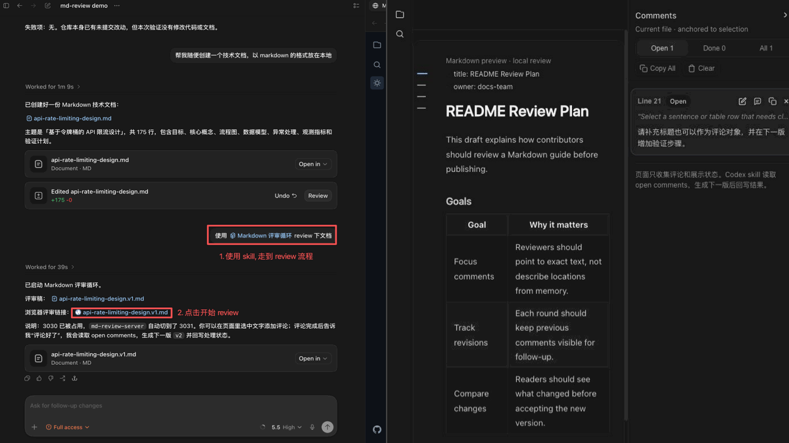
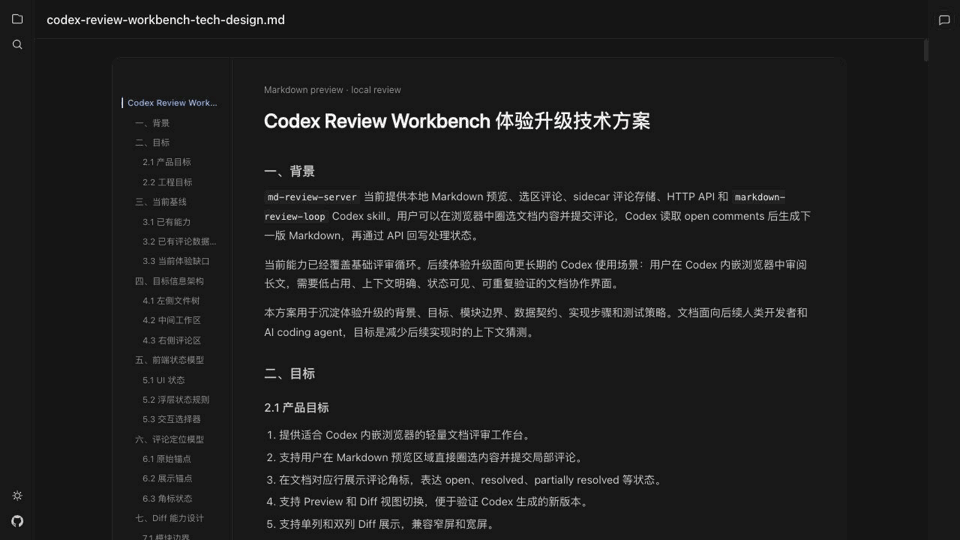
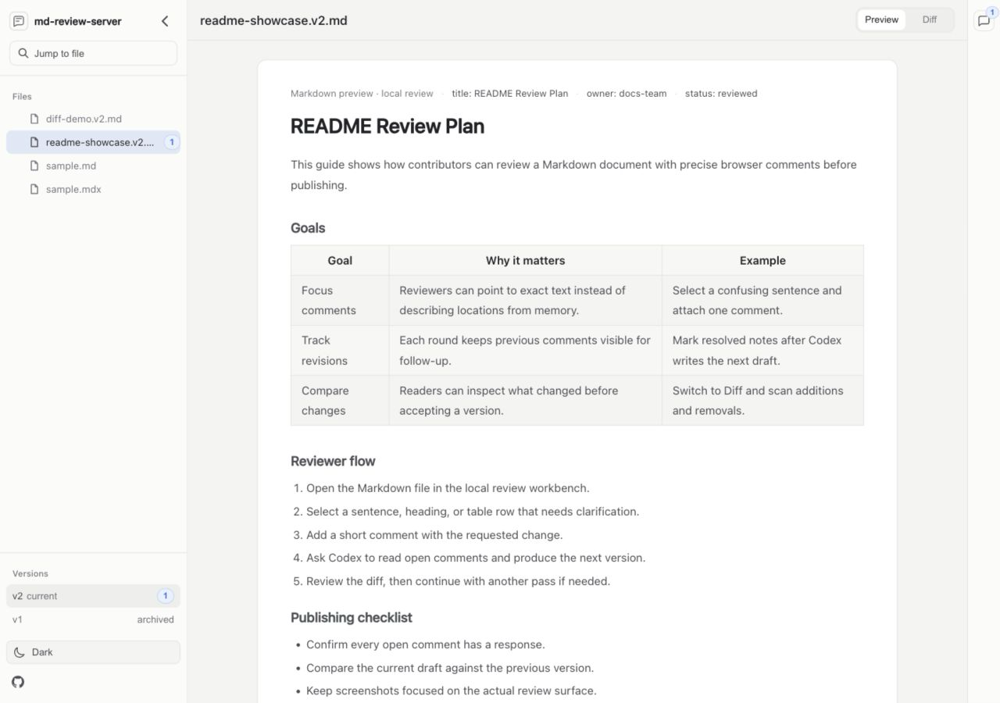
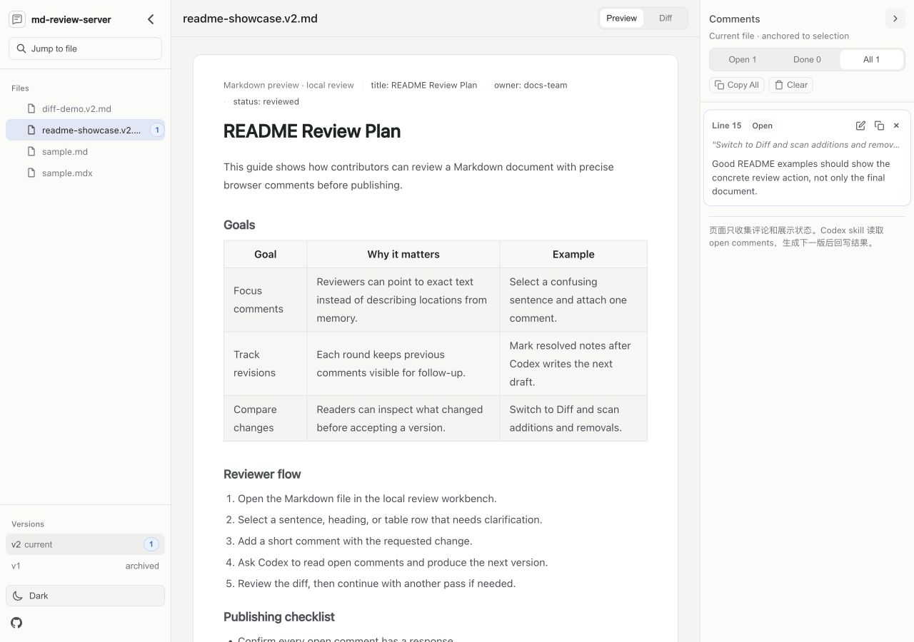
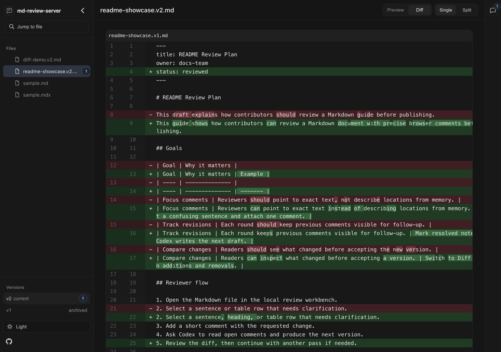

# md-review-server

[](https://www.npmjs.com/package/md-review-server)
[](./LICENSE)
[](https://github.com/tracyxiong1/md-review-server)

`md-review-server` 是面向 Codex 和本地文档作者的 Markdown 可视化评审工具。

在 Codex 中，纯对话适合提出整体修改要求，但不方便圈选长文中的具体内容并集中提交评论。`md-review-server` 提供浏览器预览、标题目录、选区批注、多轮回复、版本对比和 `markdown-review-loop` skill，用于搭建“批注 -> 修订 -> 再评审”的本地 Markdown 协作流程。

## 功能演示

### Codex 评审闭环

从 Codex 启动评审，在浏览器中提交局部评论，再由 Codex 读取评论、生成下一版并回写处理结果：



### 文档浏览与版本对比

标题目录、Mermaid 图表、版本预览，以及统一和分栏 Diff：



## 使用场景

- 评审技术方案、README、机制说明、复盘草稿等 Markdown 文档。
- 在浏览器中圈选具体文本，留下局部修改意见。
- 让 Codex 读取评论、生成下一版文档，并继续下一轮评审。
- 通过标题目录浏览长文档，通过 Mermaid 大图查看复杂图表。

## 主要能力

### 文档阅读与导航

- 预览 `.md`、`.markdown` 和 `.mdx` 文件，支持代码高亮与 Mermaid 渲染。
- 支持网络图片，以及相对于当前 Markdown 文件的本地图片路径。
- 根据 H1 至 H6 生成响应式标题目录，支持点击跳转、当前章节跟踪和长标题提示。
- 提供单文件模式和目录模式；目录模式包含文件搜索、评论数量汇总和版本历史入口。
- 识别 `guide.md`、`guide.v1.md`、`guide.v2.md` 等同系列文件，并展示各版本的评审状态。
- 在 Preview 与 Diff 间切换，Diff 支持统一视图和左右分栏视图。
- 支持浅色与深色主题，文档、代码、Mermaid、Diff 和评论面板使用一致的主题层级。

### 评论与多轮评审

- 对选中文本创建评论，并保存行号、选区偏移和上下文定位信息。
- 使用 `Open`、`Done` 和 `All` 视图管理评论，支持编辑、删除、复制和内容跳转。
- 在原评论下追加 `Codex` 或 `你` 的回复；用户回复已完成评论时，评论会重新进入 `open` 状态。
- 在新版本中显示上一轮评论的处理落点；同一行的多条评论合并为带数量的标记。
- 将评论和回复保存到 `.reviews/*.review.json` sidecar 文件，不修改 Markdown 正文。

### Mermaid 图表查看

- 在 Markdown 内渲染 Mermaid，并提供独立的大图查看入口。
- 支持适应窗口、按钮缩放、双击放大、鼠标拖动、滚轮或触控板平移，以及触控板缩放。
- 大图使用可访问对话框，支持键盘焦点约束、`Esc` 关闭和关闭后的焦点恢复。

### Codex 评审循环

- 内置 `markdown-review-loop` skill，支持安装、更新和状态检查。
- Codex 可以通过 HTTP API 读取 `open` 评论，回写处理状态、回复和新版本落点。
- 每轮修订生成新的版本化 Markdown 文件，默认保留历史版本。
- 支持只读模式；本地服务默认仅监听 `127.0.0.1`。

## 快速开始

### 安装 skill

推荐让 Codex 自动安装：

```text
帮我安装 skill：https://www.npmjs.com/package/md-review-server
```

也可以手动安装：

```sh
npx -y md-review-server@latest skill install
npx -y md-review-server@latest skill doctor
```

### 启动评审

在 Codex 中输入：

```text
使用 $markdown-review-loop 帮我启动 docs/example.md 的评审循环。
```

Codex 会打开本地评审页面。用户在浏览器中圈选文本并创建评论。

### 生成下一版

评论完成后，回到 Codex 输入：

```text
评论完了，读取评论并生成下一版。
```

Codex 会根据评论生成新版本，例如：

```text
example.v1.md -> example.v2.md
```

如果还需要继续修改，在新版文档上补充评论，然后对 Codex 说：

```text
我已经在新版上补充了评论，继续处理。
```

## 界面示例

目录模式可以同时浏览 Markdown 文件、历史版本、评论数量和主题入口：



评论会锚定到具体选区，并在右侧集中管理：



切换到 Diff 后，可以对比当前版本和上一版；深色模式会同步到 diff viewer：



## 手动启动 Review Server

不使用 Codex skill 时，可以直接启动本地服务：

```sh
npx -y md-review-server@latest docs --port 3030 --active-file docs/guide.md
```

也可以全局安装：

```sh
npm install -g md-review-server
md-review-server docs --port 3030
```

默认只监听 `127.0.0.1`。如果使用 `--host 0.0.0.0`，服务会在启动时输出安全提示。

## CLI 使用方式

```sh
md-review-server [options]              # 浏览当前目录下的 Markdown 文件
md-review-server <file> [options]       # 预览单个 Markdown 文件
md-review-server <directory> [options]  # 浏览指定目录下的 Markdown 文件
```

### 参数

```sh
-p, --port <port>           服务端口，默认 3030
    --host <host>           监听地址，默认 127.0.0.1
    --review-dir <dir>      review sidecar 目录，默认 .reviews
    --active-file <file>    目录模式下初始选中的文件
    --readonly              禁用评论写入 API
    --no-analytics          禁用匿名 Umami 访问统计
    --analytics-url <url>   覆盖 Umami script URL
    --analytics-id <id>     覆盖 Umami website ID
    --analytics-path <path> 覆盖脱敏后的统计路径，默认 /review
    --no-open               不自动打开浏览器
    skill <command>         安装、更新或检查内置 Codex skill
-h, --help                  显示帮助信息
-v, --version               显示版本号
```

### Skill 管理

```sh
md-review-server skill install          # 安装内置 skill
md-review-server skill update           # 更新内置 skill
md-review-server skill update --force   # 强制覆盖更新
md-review-server skill doctor           # 检查安装版本和状态
```

## 匿名访问统计

`md-review-server` 默认使用 Umami 统计匿名 PV/UV 和文档使用深度。页面事件在发送前会把路径统一改写为 `/review`，清空 referrer，并固定标题和 hostname；仍会包含 Umami 标准采集的屏幕尺寸和浏览器语言。

文档生命周期从第一次创建评论开始；仅预览文档不会创建生命周期数据。服务端会在本地 `.reviews/<文档名>.document.json` 中生成随机 UUID，并将 `.v1`、`.v2` 等版本化文件归入同一个文档。普通文件重命名不会自动沿用原文档 ID。

发送到 Umami 的生命周期事件只有：

- `document_initialized`：文档第一次进入评审，只发送 `document_id`
- `document_opened`：一次有效访问，同一文档 30 分钟内只计一次，发送 `document_id`、`open_seq`
- `document_revised`：发现一个此前未见过的内容版本，发送 `document_id`、`revision_seq`、`round_seq`
- `review_round_started`：某个内容版本第一次收到评论，发送 `document_id`、`revision_seq`、`round_seq`

不会向 Umami 上报 Markdown 文件名、本地路径、正文、评论内容、选区内容或内容摘要。内容摘要只保存在本地，用于识别已经见过的版本。发送失败的事件会留在本地待发送队列中，成功后再确认删除。

如果不希望发送匿名访问统计，可以关闭：

```sh
md-review-server docs --no-analytics
```

也可以使用环境变量：

```sh
MD_REVIEW_ANALYTICS=0 md-review-server docs
```

自托管或替换 Umami website 时，可以传入自己的配置：

```sh
md-review-server docs \
  --analytics-url https://cloud.umami.is/script.js \
  --analytics-id your-website-id
```

## 进阶说明

### 技术方案

体验升级和后续实现计划见 [Codex Review Workbench 体验升级技术方案](./docs/codex-review-workbench-tech-design.md)。

### 版本文件

目录模式会把名称相同、版本号不同的 Markdown 文件识别为同一版本序列：

```text
guide.md
guide.v1.md
guide.v2.md
```

版本列表按版本号降序展示，并结合评论数据标记当前版本、已评审版本和历史版本。`markdown-review-loop` 默认生成新文件，不覆盖上一版文档。

### 评论数据

评论由服务端写入 Markdown 所在的 review 目录：

```text
docs/.reviews/guide.v2.review.json
docs/.reviews/guide.md.document.json
```

评论记录包括源文件、行号、选区文本、上下文、状态、回复和处理后的目标文件位置。其中 `.review.json` 保存单个版本的评论，`.document.json` 保存同一版本系列的本地生命周期状态。支持的评论状态包括：

- `open`：等待 Codex 处理或等待用户补充。
- `resolved`：评论已经完整处理。
- `partially_resolved`：评论只完成了部分内容。
- `unresolved`：评论无法继续处理。
- `ignored`：评论被明确跳过。

用户在已完成评论下追加回复时，服务会把该评论重新设为 `open`，使其进入下一轮评审。

### HTTP API

| Method | Path                           | 用途                                   |
| ------ | ------------------------------ | -------------------------------------- |
| GET    | `/api/health`                  | 检查服务状态                           |
| GET    | `/api/session`                 | 获取模式、根目录、活动文件和只读状态   |
| GET    | `/api/files`                   | 获取目录模式中的 Markdown 文件列表     |
| GET    | `/api/markdown`                | 读取单文件模式中的 Markdown            |
| GET    | `/api/markdown/:path`          | 读取目录模式中的指定 Markdown          |
| GET    | `/api/watch`                   | 订阅文件变更事件                       |
| GET    | `/api/comments`                | 按文件、状态或目标文件读取评论         |
| POST   | `/api/comments`                | 创建评论                               |
| PATCH  | `/api/comments/:id`            | 更新评论、追加回复或回写处理结果       |
| PATCH  | `/api/comments`                | 批量回写评论状态、回复和新版本目标位置 |
| DELETE | `/api/comments/:id`            | 删除评论                               |
| POST   | `/api/document-analytics/sync` | 读取本地待发送的脱敏文档生命周期事件   |
| POST   | `/api/document-analytics/ack`  | 确认已成功发送的文档生命周期事件       |

## 本地开发

```sh
pnpm install
pnpm dev
pnpm test
pnpm build
pnpm lint
```

## 发版和 CHANGELOG

版本变更记录在 [CHANGELOG.md](./CHANGELOG.md)。

项目通过 GitHub Actions 中的 Release Please 管理发版。合入 `main` 的 Conventional Commit 会被收集到 release PR 中，该 PR 会更新 `package.json`、`.release-please-manifest.json` 和 `CHANGELOG.md`。合并 release PR 后，CI 会创建 GitHub Release 和版本 tag，并发布到 npm。

常用提交前缀：

- `feat:` 进入 minor release。
- `fix:` 进入 patch release。
- `feat!:`、`fix!:` 或带 `BREAKING CHANGE:` footer 的提交进入 major release。

手动推送 `v*.*.*` tag 仍会触发 npm 发布，但不会自动补写 CHANGELOG。常规发版使用 Release Please 生成的 release PR。

## License

[MIT](./LICENSE)
