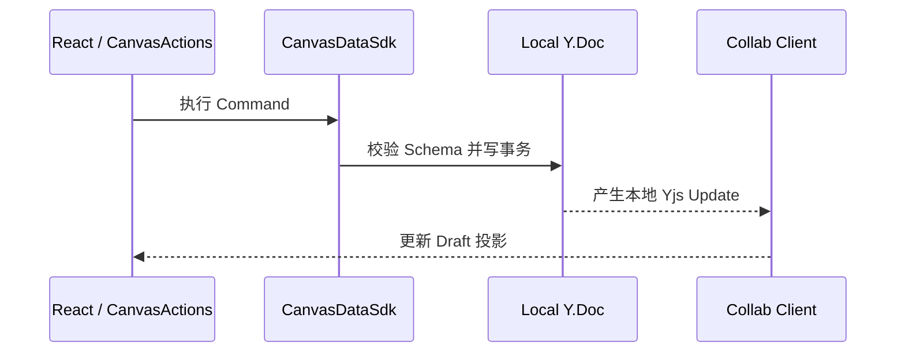
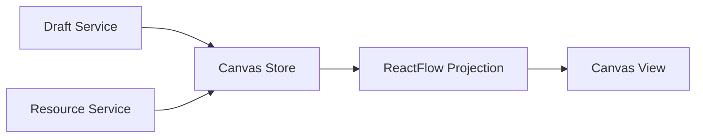

# Color compatibility baseline

This fixture validates Mermaid and syntax highlighting against the app's light and dark themes.

## Sequence diagram



## Flowchart



## JSON

```json
{
  "draftVersion": 42,
  "schemaVersion": 1,
  "resourceId": "res-original",
  "active": true
}
```

## TypeScript

```ts
const applyDraft = (version: number, resourceId: string) => {
  return { version, resourceId, status: "accepted" };
};
```
