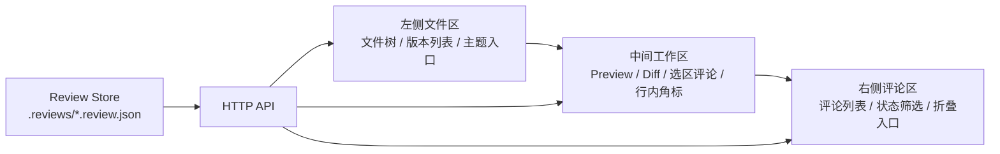

# Codex Minimal Review 功能规格

## 一、文档目标

`design-drafts/codex-minimal-review.html` 是 `md-review-server` 下一阶段体验升级的交互原型。该 HTML 同时表达了视觉方向、页面信息架构、状态切换和部分交互规则。后续实现不应只复用其中的颜色、间距和布局，也需要将原型中的状态语义转化为可测试的功能契约。

本文档用于说明该原型对应的功能细节、数据来源、组件职责、状态流转和验收标准。文档面向后续人类开发者和 AI coding agent，目标是降低继续实现时的上下文猜测。

## 二、目标界面结构

目标界面是一个面向 Codex 内嵌浏览器的三栏文档评审工作台。



| 区域       | 原型节点                                                        | 功能职责                                         |
| ---------- | --------------------------------------------------------------- | ------------------------------------------------ |
| 左侧文件区 | `.sidebar`、`.tree`、`.versions`、`.theme-toggle`               | 文件切换、版本切换、评论数量提示、主题切换       |
| 中间工作区 | `.main`、`.topbar`、`.reader`、`.document`                      | Markdown 预览、Diff 切换、选区评论、历史评论角标 |
| 右侧评论区 | `.comments`、`.comment-tabs`、`.comment-list`、`.comments-rail` | 评论状态总览、评论筛选、评论跳转、折叠入口       |
| 浮层系统   | `.popover`、`.inline-editor`、`.history-card`                   | 选区评论入口、评论输入、历史处理结果查看         |

## 三、原型到功能的映射

### 3.1 文件树状态

原型中的文件树不只是文件列表。它包含当前文件、目录数量、文件评论数量和历史版本状态。

| 原型展示                       | 功能含义                    | 数据来源                              |
| ------------------------------ | --------------------------- | ------------------------------------- |
| `docs 8`                       | 目录内 Markdown 文件数量    | `GET /api/files` 扫描结果             |
| `browser-automation.v4.md 3`   | 当前文件存在 3 条 open 评论 | review summary 中当前文件 `openCount` |
| `browser-automation.v3.md old` | 历史版本文件                | 文件名版本解析结果                    |
| `outputs 12`                   | 目录内 Markdown 文件数量    | `GET /api/files` 扫描结果             |

实现要求：

1. 文件树应支持目录展开和折叠。
2. 文件树应在文件行展示当前文件的 open 评论数量。
3. 文件树应在目录行展示该目录下 Markdown 文件数量。
4. 历史版本文件可以显示 `old` 或 `history` 标签，当前版本文件显示 open 数量。
5. 搜索状态下仍应保留当前选中文件样式。

### 3.2 版本区状态

原型中的 `Versions` 区域用于表达当前文档的版本链和每个版本的评审状态。

| 原型展示             | 功能含义                     | 计算规则                                 |
| -------------------- | ---------------------------- | ---------------------------------------- |
| `v4 current 3`       | 当前版本仍有 3 条 open 评论  | 当前选中文件版本最大，且 `openCount = 3` |
| `v3 reviewed 4 done` | 上一版本评论已被 Codex 处理  | 该版本 open 为 0，done 为 4              |
| `v2 draft archived`  | 更早版本，不作为当前评审入口 | 低于上一轮版本，且无活跃评论             |

建议新增 `ReviewSummary` 数据模型：

```ts
type VersionReviewState = "current" | "reviewed" | "draft" | "archived";

interface FileReviewSummary {
  file: string;
  openCount: number;
  doneCount: number;
  allCount: number;
}

interface VersionReviewSummary extends FileReviewSummary {
  label: string;
  version: number;
  state: VersionReviewState;
}
```

实现要求：

1. 版本区基于同一目录、同一 stem、同一扩展名聚合版本。
2. 当前选中文件显示 `current`。
3. open 数量大于 0 时，右侧显示 open 数量徽标。
4. open 数量为 0 且 done 数量大于 0 时，右侧显示 `${doneCount} done`。
5. 更早版本且无可操作评论时，显示 `archived`。

### 3.3 顶部视图切换

原型顶部只保留文档标题和紧凑视图切换。

| 原型节点       | 功能规则                                  |
| -------------- | ----------------------------------------- |
| `.file-title`  | 展示当前文件名，不展示路径细节            |
| `.view-toggle` | 单按钮在 Preview 和 Diff 之间切换         |
| `.diff-layout` | 仅在 Diff 视图显示，支持 Unified 和 Split |

实现要求：

1. 默认进入 Preview。
2. 点击 `Preview` 后进入 Diff，按钮文案变为 `Diff`。
3. 点击 `Diff` 后回到 Preview，按钮文案变为 `Preview`。
4. Diff 默认使用 `unified`。
5. 进入 Diff 时关闭选区评论框和历史评论浮层。
6. 无上一版本内容时不展示视图切换按钮。

### 3.4 Markdown 预览区

预览区是主要阅读和圈选区域。

实现要求：

1. 正文宽度应限制在适合阅读的范围内。
2. Preview 文档容器承载 Markdown 渲染结果。
3. 文档 meta 显示当前视图和版本状态，例如 `Markdown preview · v4 current · local review`。
4. Preview 视图允许选区评论。
5. Diff 视图不允许创建新评论。
6. 行内角标位于对应行左侧，并垂直居中。

### 3.5 选区评论入口和输入框

原型中选中文本后先出现轻量 `Comment` popover，点击后出现 inline editor。

状态规则：

| 事件                    | 行为                                |
| ----------------------- | ----------------------------------- |
| 用户选中文本            | 显示 `Comment` popover              |
| 点击 `Comment`          | 打开 inline editor                  |
| 输入评论并点击 `Submit` | 创建 comment，关闭 editor，清理选区 |
| 点击 `Cancel`           | 关闭 editor，清理选区               |
| 点击空白区域            | 关闭当前浮层                        |
| 按 `Esc`                | 关闭当前浮层                        |
| 滚动或 resize           | 重新计算 editor 位置                |

位置规则：

1. editor 优先显示在选区下方。
2. 下方空间不足时显示在选区上方。
3. 左右边界必须限制在 viewport 内。
4. editor 与 history card 互斥。
5. editor 打开时隐藏轻量 `Comment` popover。

### 3.6 行内评论角标

原型中行内角标用于表达评论在正文中的处理状态。

| 状态                 | 图标                        | 行为                                 |
| -------------------- | --------------------------- | ------------------------------------ |
| `open`               | comment icon                | 点击打开评论输入或当前 open 评论详情 |
| `resolved`           | check icon                  | 点击打开 history card                |
| `partially_resolved` | exclamation icon            | 点击打开 history card                |
| `unresolved`         | exclamation 或 warning icon | 点击打开 history card                |

实现要求：

1. open 评论角标来自当前文件 comments。
2. resolved、partially_resolved、unresolved 角标来自 target comments。
3. 多条评论落在同一行时，角标显示数量徽标。
4. 点击角标打开对应浮层。
5. 点击空白区域或按 `Esc` 关闭浮层。
6. 角标应有可访问名称，例如 `Review comments on line 91`。

### 3.7 历史评论卡片

历史评论卡片用于解释上一轮评论在当前版本中的处理结果。

展示字段：

| 字段     | 来源                                   |
| -------- | -------------------------------------- |
| 状态标签 | `comment.status`                       |
| 来源位置 | `${comment.file}:${comment.startLine}` |
| 评论正文 | `comment.comment`                      |
| 处理结果 | `comment.resolution`                   |

实现要求：

1. history card 使用 fixed 或 portal 定位，避免被滚动容器裁剪。
2. history card 与 inline editor 互斥。
3. 打开一个 marker 时关闭其他 marker 浮层。
4. 位置应贴近对应行角标，并保持在 viewport 内。

### 3.8 右侧评论区

右侧评论区是当前文件评论状态总览，不是主要输入入口。

| 原型节点               | 功能规则                        |
| ---------------------- | ------------------------------- |
| `.comment-tabs`        | 支持 `Open`、`Done`、`All` 筛选 |
| `.comment-item.active` | 表示当前聚焦或最近选中的评论    |
| `.comments-rail`       | 折叠状态下的评论入口            |
| `.rail-count`          | 当前文件 open 评论数量          |

筛选规则：

1. 默认展示 `All`，保持 MVP 中“当前文件全部评论可见”的行为。
2. `Open` 只展示 `status = open`。
3. `Done` 展示 `resolved`、`partially_resolved`、`unresolved`、`ignored`。
4. tab 计数始终基于当前文件全部评论计算。
5. 点击评论行号应滚动到正文对应行。

折叠规则：

1. 当前文件没有评论时，右侧默认折叠。
2. 当前文件有评论时，右侧默认展开。
3. 折叠状态下显示 rail 和 open 数量。
4. 窄屏状态下，点击 rail 以 overlay 方式展开评论区，不压缩正文到不可读状态。

### 3.9 主题状态

主题入口位于左侧底部。

实现要求：

1. 默认跟随系统主题。
2. 用户切换后写入 `localStorage`。
3. 展开状态显示 `Dark theme` 或 `Light theme`。
4. 折叠状态只显示图标。
5. 深浅主题使用同一套语义 token，不在组件中硬编码状态色。

## 四、数据契约

### 4.1 ReviewComment

当前 sidecar schema 已覆盖 MVP 所需字段。短期实现不需要迁移 `.reviews/*.review.json`。

```ts
type ReviewCommentStatus =
  | "open"
  | "resolved"
  | "partially_resolved"
  | "unresolved"
  | "ignored";

interface ReviewComment {
  id: string;
  file?: string;
  documentVersion?: string;
  startLine: number;
  endLine: number;
  startOffset?: number;
  endOffset?: number;
  selectedText: string;
  beforeText?: string;
  afterText?: string;
  comment: string;
  status: ReviewCommentStatus;
  targetFile?: string;
  targetStartLine?: number;
  targetEndLine?: number;
  targetSelectedText?: string;
  resolution?: string;
  consumedBy?: string;
  consumedAt?: string;
  createdAt: string;
  updatedAt?: string;
}
```

`targetStartLine` / `targetEndLine` 使用目标文件中从 1 开始的绝对行号，包含 YAML frontmatter 和 MDX import/export 等源文件行。

### 4.2 ReviewSummary

建议在前端新增 `useReviewSummary(files)`，第一阶段可通过 `GET /api/comments` 获取全量评论后在前端聚合。后续如果评论数量明显变大，再增加服务端 summary API。

```ts
interface ReviewSummary {
  byFile: Record<string, FileReviewSummary>;
  byDirectory: Record<string, DirectoryReviewSummary>;
}

interface DirectoryReviewSummary {
  dir: string;
  fileCount: number;
  openCount: number;
  doneCount: number;
  allCount: number;
}
```

聚合规则：

1. `openCount` 只统计 `status = open`。
2. `doneCount` 统计非 open 状态。
3. `allCount = openCount + doneCount`。
4. 目录计数以 Markdown 文件数量为准，评论数量作为附加状态。
5. target comments 不计入源文件 open 数量，但可用于当前文件 marker。

### 4.3 版本解析

版本文件名采用现有规则：

```ts
/^(?<stem>.+?)(?:\.v(?<version>\d+))?(?<ext>\.md|\.markdown|\.mdx)$/;
```

解析结果：

```ts
interface MarkdownVersionInfo {
  dir: string;
  stem: string;
  ext: string;
  version: number;
}
```

未带 `.vN` 的文件视为 `version = 0`，展示标签为 `draft`。

## 五、前端状态模型

### 5.1 Workbench 状态

建议将跨组件状态集中到工作台层，避免 `SelectionPopover`、`ProcessedCommentMarker`、`CommentList` 各自管理互斥浮层。

```ts
type ViewMode = "preview" | "diff";
type DiffLayout = "unified" | "split";
type PanelState = "expanded" | "collapsed";

type FloatingLayer =
  | { type: "none" }
  | { type: "selectionMenu"; anchor: SelectionAnchor }
  | { type: "commentEditor"; anchor: SelectionAnchor }
  | { type: "commentHistory"; commentIds: string[]; line: number };

interface ReviewWorkbenchState {
  viewMode: ViewMode;
  diffLayout: DiffLayout;
  leftPanel: PanelState;
  rightPanel: PanelState;
  floatingLayer: FloatingLayer;
}
```

### 5.2 状态转换

| 事件                  | 状态变化                                  |
| --------------------- | ----------------------------------------- | ------ |
| 选中文本              | `floatingLayer = selectionMenu`           |
| 点击 Comment          | `floatingLayer = commentEditor`           |
| 提交评论              | `floatingLayer = none`，刷新 comments     |
| 点击 processed marker | `floatingLayer = commentHistory`          |
| 点击空白区域          | `floatingLayer = none`                    |
| 按 `Esc`              | `floatingLayer = none`                    |
| 切换到 Diff           | `viewMode = diff`，`floatingLayer = none` |
| 切回 Preview          | `viewMode = preview`                      |
| 切换 Diff layout      | `diffLayout = unified                     | split` |
| 折叠右侧评论          | `rightPanel = collapsed`                  |
| 展开右侧评论          | `rightPanel = expanded`                   |

### 5.3 z-index 层级

建议使用语义层级，避免任意 `999`。

| 层级          | 用途                         |
| ------------- | ---------------------------- |
| `--z-sticky`  | 顶部栏、侧栏                 |
| `--z-marker`  | 行内评论角标                 |
| `--z-popover` | selection menu、history card |
| `--z-editor`  | inline editor                |
| `--z-overlay` | 窄屏评论区 overlay           |
| `--z-tooltip` | 快捷键提示                   |

## 六、组件职责

### 6.1 `DevModeApp`

职责：

1. 获取文件列表。
2. 维护当前选中文件。
3. 获取当前文件 Markdown 内容。
4. 获取上一版本内容。
5. 获取评论 summary。
6. 将 `files`、`selectedFile`、`reviewSummary` 传给 `FileTree`。
7. 将 `comments`、`targetComments`、`reviewSummary` 传给 `MarkdownPreview`。

### 6.2 `FileTree`

职责：

1. 渲染文件树。
2. 渲染目录文件数。
3. 渲染文件 open 评论数。
4. 渲染版本区。
5. 触发文件切换。

边界：

1. 不直接请求 comments API。
2. 不修改评论状态。
3. 不关心 Markdown 内容。

### 6.3 `MarkdownPreview`

职责：

1. 渲染 Preview 和 Diff。
2. 创建 line markers。
3. 管理中间区域滚动定位。
4. 接收并渲染选区评论入口。
5. 接收并渲染 history card。
6. 在视图切换时关闭浮层。

边界：

1. 不直接聚合全局评论 summary。
2. 不负责文件树版本状态。
3. 不直接访问 sidecar 文件。

### 6.4 `CommentList`

职责：

1. 渲染当前文件评论列表。
2. 支持 `Open`、`Done`、`All` 筛选。
3. 支持编辑、复制、删除评论。
4. 支持点击行号定位正文。
5. 显示处理结果 `resolution`。

边界：

1. 不承担主要评论输入入口。
2. 不负责 target comment 的行内定位。

### 6.5 `SelectionPopover`

职责：

1. 读取当前 selection。
2. 计算 line range、offset、beforeText、afterText。
3. 渲染 selection menu 和 inline editor。
4. 保证浮层不越界。

边界：

1. 不直接写入 API。
2. 通过 `onSubmitComment` 将结构化数据交给上层。

## 七、响应式行为

### 7.1 宽屏

默认结构：

```css
grid-template-columns: 236px minmax(0, 1fr) 304px;
```

行为：

1. 左侧默认展开。
2. 右侧在有评论时默认展开。
3. 中间阅读宽度限制在约 820px。
4. Diff Split 视图可扩展到约 1160px。

### 7.2 中窄屏

触发条件参考原型中的 `1180px`。

行为：

1. 左侧收敛为 rail。
2. 右侧收敛为 rail。
3. 点击右侧 rail 以 overlay 方式展开评论区。
4. overlay 不应压缩正文到不可读宽度。
5. overlay 展开时点击空白或 `Esc` 关闭。

### 7.3 小屏

小屏优先保证阅读和评论输入可用。

行为：

1. 文件树默认折叠。
2. 评论区默认折叠。
3. inline editor 宽度不超过 viewport。
4. Diff Split 可自动降级为 Unified。

## 八、测试与验收标准

### 8.1 数据聚合测试

1. `useReviewSummary` 能按 file 聚合 open、done、all。
2. `useReviewSummary` 能按 directory 聚合文件数量。
3. 版本解析能识别 `guide.md`、`guide.v2.md`、`guide.v10.md`。
4. 版本区能识别 current、reviewed、draft、archived。
5. target comments 不污染源文件 open 数量。

### 8.2 文件树测试

1. 当前文件显示 open 数量徽标。
2. 目录行显示 Markdown 文件数量。
3. 历史版本显示 `old` 或 `history`。
4. 点击版本行切换文件。
5. 搜索后仍能显示匹配文件和当前选中状态。

### 8.3 浮层测试

1. 选中文本后显示 `Comment` popover。
2. 点击 `Comment` 打开 inline editor。
3. editor 在 viewport 内。
4. 点击空白区域关闭 editor。
5. 按 `Esc` 关闭 editor。
6. 打开 history card 时关闭 editor。
7. 切换到 Diff 时关闭所有浮层。

### 8.4 Marker 测试

1. open 评论显示 comment icon。
2. resolved 评论显示 check icon。
3. partially resolved 评论显示 exclamation icon。
4. 多条评论同一行显示数量徽标。
5. 点击 marker 展示对应评论内容和 resolution。
6. 点击空白区域关闭 marker 浮层。

### 8.5 Diff 测试

1. 有上一版本时显示 Preview / Diff 切换按钮。
2. 默认进入 Preview。
3. 点击 Preview 后进入 Diff。
4. Diff 默认使用 Unified。
5. 点击 Split 后切换到双列 Diff。
6. 无上一版本时隐藏 Diff 控件。

### 8.6 评论区测试

1. 无评论时右侧默认折叠。
2. 有评论时右侧默认展开。
3. rail 显示 open 数量。
4. `Open` 只显示 open 评论。
5. `Done` 显示非 open 评论。
6. `All` 显示全部评论。
7. 点击行号滚动到正文对应行。

### 8.7 主题测试

1. 默认跟随系统主题。
2. 用户切换主题后写入 localStorage。
3. 深浅主题下正文、评论、状态徽标满足可读性要求。
4. 折叠左栏中主题入口仍可访问。

## 九、实施分期

### 9.1 P0：功能语义对齐

目标是让真实实现具备原型中的核心状态语义。

范围：

1. 新增 `useReviewSummary`。
2. 将 review summary 接入 `FileTree` 和版本区。
3. 将 marker 图标按状态区分。
4. 统一浮层关闭规则。
5. 对齐 Preview / Diff / Unified / Split 状态。
6. 补充对应单元测试。

不包含：

1. 大规模视觉重构。
2. sidecar schema 迁移。
3. 服务端 summary API。

### 9.2 P1：响应式与浮层系统完善

目标是补齐 Codex 内嵌浏览器中的窄屏体验。

范围：

1. 右侧评论区窄屏 overlay 展开。
2. 左侧文件区折叠 rail 状态优化。
3. history card fixed 定位和 viewport clamp。
4. `Esc` 和空白点击的全局浮层管理。
5. 增加 Playwright 或浏览器流程验证。

### 9.3 P2：服务端 summary API

目标是减少前端全量拉取评论后的聚合成本。

候选接口：

```http
GET /api/review-summary
```

返回：

```ts
interface ReviewSummaryResponse {
  files: FileReviewSummary[];
  directories: DirectoryReviewSummary[];
}
```

该阶段仅在评论数量、目录数量或性能指标需要时实施。

## 十、AI 开发约束

后续 AI 修改该功能时应遵守以下约束：

1. 先修改数据模型和测试，再修改视觉样式。
2. 不从 DOM 文案反推业务状态。
3. 不让 `FileTree`、`CommentList`、`MarkdownPreview` 分别请求同一份全局 summary。
4. 不使用只在 demo 中存在的硬编码版本文案。
5. 不把 open、done、all 的计数写死在 UI 层。
6. 不在组件中直接硬编码状态色，应使用语义 token。
7. 不引入新的评论数据源，sidecar JSON 仍是唯一评论数据源。
8. 每个新增状态至少有一个单元测试或浏览器流程验证。

## 十一、当前实现缺口清单

基于当前 React 实现和原型对照，待补齐项如下：

| 缺口                             | 影响                                     | 建议阶段 |
| -------------------------------- | ---------------------------------------- | -------- |
| 文件树缺少评论 summary           | 文件角标和目录状态无法准确显示           | P0       |
| 版本区只按文件名推断状态         | `current/reviewed/archived` 语义不完整   | P0       |
| marker 图标未按状态区分          | open、resolved、partial 的正文反馈不清晰 | P0       |
| 浮层状态分散                     | editor、history card、popover 容易冲突   | P0       |
| Diff 缺少原型中的统计头语义      | 用户难以快速判断改动规模                 | P1       |
| 窄屏 comments overlay 未完整实现 | Codex 内嵌浏览器中右侧区域占用过高       | P1       |
| 主题状态文案和系统主题策略需统一 | 深浅主题体验不稳定                       | P1       |

## 十二、结论

`codex-minimal-review.html` 应作为功能原型使用。后续实现的第一阶段应优先补齐 review summary、版本状态、marker 状态和浮层互斥规则。视觉细节可以继续沿用当前 token 和 CSS，但功能状态需要由稳定数据模型驱动，避免继续通过静态样式模拟原型效果。
