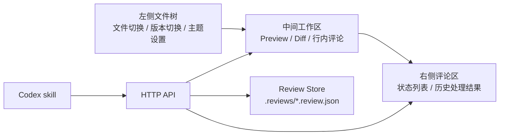

# Codex Review Workbench 体验升级技术方案

## 一、背景

`md-review-server` 当前提供本地 Markdown 预览、选区评论、sidecar 评论存储、HTTP API 和 `markdown-review-loop` Codex skill。用户可以在浏览器中圈选文档内容并提交评论，Codex 读取 open comments 后生成下一版 Markdown，再通过 API 回写处理状态。

当前能力已经覆盖基础评审循环。后续体验升级面向更长期的 Codex 使用场景：用户在 Codex 内嵌浏览器中审阅长文，需要低占用、上下文明确、状态可见、可重复验证的文档协作界面。

本方案用于沉淀体验升级的背景、目标、模块边界、数据契约、实现步骤和测试策略。文档面向后续人类开发者和 AI coding agent，目标是减少后续实现时的上下文猜测。

## 二、目标

### 2.1 产品目标

1. 提供适合 Codex 内嵌浏览器的轻量文档评审工作台。
2. 支持用户在 Markdown 预览区域直接圈选内容并提交局部评论。
3. 在文档对应行展示评论角标，表达 open、resolved、partially resolved 等状态。
4. 支持 Preview 和 Diff 视图切换，便于验证 Codex 生成的新版本。
5. 支持单列和双列 Diff 展示，兼容窄屏和宽屏。
6. 保持文件树、评论区、浮层、主题切换等基础交互稳定。

### 2.2 工程目标

1. 保持服务端作为评论数据唯一写入方。
2. 保持 Codex skill 只依赖 HTTP API，不依赖前端 DOM 或本地私有实现。
3. 将复杂逻辑沉淀为可测试的纯函数，包括评论定位、Diff 数据转换、浮层状态流转。
4. 使用明确的数据类型和 fixtures，便于 AI 后续开发、测试和维护。
5. 避免一次性重写现有 UI，在当前能力上分阶段演进。

## 三、当前基线

### 3.1 已有能力

| 模块     | 当前能力                                                                       |
| -------- | ------------------------------------------------------------------------------ |
| CLI      | 支持文件模式、目录模式、端口、host、review-dir、active-file、readonly、no-open |
| Server   | 基于 Hono 提供 session、files、markdown、comments API                          |
| Store    | 使用 `.reviews/*.review.json` 保存评论，支持创建、编辑、删除、批量状态回写     |
| Frontend | 支持 Markdown 预览、文件树、评论列表、选区评论、深色模式                       |
| Skill    | 支持安装、更新、启动 review server、读取 open comments、生成下一版、回写状态   |

### 3.2 已有评论数据结构

当前 `ReviewComment` 已包含以下核心字段：

```ts
type ReviewCommentStatus =
  | "open"
  | "resolved"
  | "partially_resolved"
  | "unresolved"
  | "ignored";

interface ReviewComment {
  id: string;
  file?: string;
  documentVersion?: string;
  startLine: number;
  endLine: number;
  startOffset?: number;
  endOffset?: number;
  selectedText: string;
  beforeText?: string;
  afterText?: string;
  comment: string;
  status: ReviewCommentStatus;
  targetFile?: string;
  targetStartLine?: number;
  targetEndLine?: number;
  targetSelectedText?: string;
  resolution?: string;
  consumedBy?: string;
  consumedAt?: string;
  createdAt: string;
  updatedAt?: string;
}
```

`targetStartLine` / `targetEndLine` 使用目标文件中从 1 开始的绝对行号，计入 YAML frontmatter 和 MDX import/export 等源文件行。前端预处理 Markdown 时负责将绝对行号转换为渲染正文行号。

### 3.3 当前体验缺口

| 问题                       | 影响                                 | 升级方向                 |
| -------------------------- | ------------------------------------ | ------------------------ |
| 评论输入位于右侧区域       | Codex 内嵌浏览器中视线跳转明显       | 改为选区附近的行内输入框 |
| 评论处理状态只在列表中展示 | 用户难以在正文中感知历史评论         | 在正文行旁展示状态角标   |
| 缺少版本对比视图           | 用户难以确认 Codex 是否正确响应评论  | 增加 Preview / Diff 切换 |
| 浮层状态分散               | 容易出现浮层重叠、无法关闭、位置越界 | 引入统一浮层状态         |
| 主题和布局仍偏原型         | 深浅主题、折叠状态、窄屏体验需要统一 | 建立稳定 UI 状态模型     |

## 四、目标信息架构

目标界面维持三栏结构，并允许左右区域折叠。



### 4.1 左侧文件树

职责：

1. 展示 Markdown 文件和历史版本。
2. 支持展开、折叠和文件切换。
3. 展示当前文件的 open 评论计数。
4. 在折叠状态下保留最小入口。
5. 放置主题设置入口。

约束：

1. 文件树只负责导航，不承载评论编辑。
2. 折叠状态不丢失当前选中文件和当前版本。
3. 主题切换需要在折叠状态下仍可访问。

### 4.2 中间工作区

职责：

1. 展示 Markdown Preview。
2. 展示 Diff 视图。
3. 承载选区附近的评论输入框。
4. 展示行内评论角标。
5. 处理点击空白区域、`Esc`、滚动和 resize 时的浮层行为。

约束：

1. Preview 和 Diff 同时只展示一个。
2. Diff 视图默认不创建新评论。
3. 行内浮层必须在可视区域内。
4. 同一时间只允许一个浮层处于打开状态。

### 4.3 右侧评论区

职责：

1. 展示当前文件评论列表。
2. 支持按 open、done、all 过滤。
3. 展示评论状态和处理结果。
4. 提供从列表定位到正文角标的入口。
5. 在无评论时默认折叠。

约束：

1. 右侧评论区是状态总览，不作为主要评论输入入口。
2. 折叠状态下保留评论入口和计数。
3. 评论列表状态与正文角标状态来自同一份数据。

## 五、前端状态模型

### 5.1 UI 状态

建议新增集中式 UI 状态，避免多个组件自行管理互斥关系。

```ts
type ViewMode = "preview" | "diff";
type DiffLayout = "unified" | "split";
type PanelState = "expanded" | "collapsed";
type ThemeMode = "light" | "dark" | "system";

type FloatingLayer =
  | { type: "none" }
  | { type: "commentEditor"; anchor: SelectionAnchor }
  | { type: "commentHistory"; commentId: string };

interface ReviewWorkbenchState {
  viewMode: ViewMode;
  diffLayout: DiffLayout;
  leftPanel: PanelState;
  rightPanel: PanelState;
  floatingLayer: FloatingLayer;
  theme: ThemeMode;
}
```

### 5.2 浮层状态规则

| 事件                                        | 状态变化                                             |
| ------------------------------------------- | ---------------------------------------------------- |
| 用户选区并点击 Comment                      | `floatingLayer = commentEditor`                      |
| 用户点击 open 评论角标                      | `floatingLayer = commentEditor` 或跳转到已有评论详情 |
| 用户点击 resolved / partially_resolved 角标 | `floatingLayer = commentHistory`                     |
| 用户点击空白区域                            | `floatingLayer = none`                               |
| 用户按 `Esc`                                | `floatingLayer = none`                               |
| 用户切换到 Diff                             | `floatingLayer = none`                               |
| 用户滚动或 resize                           | 重新计算当前浮层位置                                 |
| 用户打开一个浮层                            | 自动关闭其他浮层                                     |

### 5.3 交互选择器

为便于 E2E 测试和 AI 修改，关键节点应保留稳定 `data-testid`。

| 元素                | 建议 test id                  |
| ------------------- | ----------------------------- |
| Preview / Diff 切换 | `view-toggle`                 |
| Diff 单列按钮       | `diff-layout-unified`         |
| Diff 双列按钮       | `diff-layout-split`           |
| 左侧折叠按钮        | `left-panel-toggle`           |
| 右侧折叠按钮        | `right-panel-toggle`          |
| 行内评论输入框      | `inline-comment-editor`       |
| 评论历史浮层        | `comment-history-popover`     |
| 评论角标            | `review-marker-${comment.id}` |
| 评论列表项          | `comment-item-${comment.id}`  |

## 六、评论定位模型

### 6.1 原始锚点

评论创建时保存用户选区所在的原始位置。

```ts
interface CommentAnchor {
  file: string;
  startLine: number;
  endLine: number;
  startOffset?: number;
  endOffset?: number;
  selectedText: string;
  beforeText?: string;
  afterText?: string;
}
```

该结构已经基本存在于当前 `ReviewComment` 中。后续实现可以先复用现有字段，不需要立即迁移 sidecar schema。

### 6.2 展示锚点

在新版本文件中展示历史评论时，需要计算评论当前应出现的位置。

```ts
type AnchorConfidence = "exact" | "context" | "line" | "fallback";

interface ResolvedAnchor {
  file: string;
  startLine: number;
  endLine: number;
  startOffset?: number;
  endOffset?: number;
  confidence: AnchorConfidence;
}
```

匹配策略按优先级执行：

1. 使用 `selectedText + beforeText + afterText` 做完整上下文匹配。
2. 使用 `selectedText` 做单独匹配。
3. 使用 `targetStartLine` / `targetEndLine` 做目标行匹配。
4. 使用原始 `startLine` / `endLine` 做回退展示。
5. 无法定位时只在右侧评论区展示，不在正文强行放置角标。

### 6.3 角标状态

```ts
interface ReviewMarker {
  commentId: string;
  status: ReviewCommentStatus;
  anchor: ResolvedAnchor;
  count?: number;
}
```

渲染规则：

1. 同一行只有一条评论时展示单个状态 icon。
2. 同一行多条评论时展示聚合角标和数量。
3. open 状态使用评论 icon。
4. resolved 状态使用成功 icon。
5. partially_resolved / unresolved 使用 warning icon。
6. ignored 默认不在正文展示，可在右侧 all 列表中展示。

## 七、Diff 能力设计

### 7.1 模块边界

Diff 能力拆成两层：

1. Diff 数据层：负责读取基准文件、目标文件并生成结构化 diff。
2. Diff 视图层：负责渲染 unified 或 split 布局。

前端不直接依赖具体 diff 库的输出结构。服务端或前端适配层需要将 diff 库结果转换为内部 `DiffHunk`。

### 7.2 数据结构

```ts
interface DiffInput {
  baseFile: string;
  targetFile: string;
  baseContent: string;
  targetContent: string;
}

type DiffRowType = "context" | "insert" | "delete";

interface DiffRow {
  type: DiffRowType;
  oldLine?: number;
  newLine?: number;
  oldText?: string;
  newText?: string;
}

interface DiffHunk {
  oldStart: number;
  oldLines: number;
  newStart: number;
  newLines: number;
  rows: DiffRow[];
}
```

### 7.3 视图模式

| 模式          | 使用场景                 | 行为                             |
| ------------- | ------------------------ | -------------------------------- |
| Unified       | 默认模式，小屏和快速浏览 | 删除、插入、上下文行在同一列展示 |
| Split         | 宽屏对比                 | 左侧旧版本，右侧新版本           |
| Stacked Split | 窄屏降级                 | 旧版本和新版本上下堆叠           |

### 7.4 文件选择策略

默认 Diff 基准可以按版本号推断：

1. 当前文件为 `guide.v4.md` 时，默认基准为同目录下的 `guide.v3.md`。
2. 当前文件为 `guide.md` 且存在 `guide.v1.md` 时，不自动进入 Diff。
3. 用户后续可以在文件树中显式选择基准版本。

## 八、HTTP API 扩展

### 8.1 评论列表扩展

当前接口：

```http
GET /api/comments?file=&status=&targetFile=
```

建议扩展：

```http
GET /api/comments?file=&status=&targetFile=&includeAnchors=1
```

当 `includeAnchors=1` 时，返回评论附带展示锚点。

```ts
interface ReviewCommentWithAnchor extends ReviewComment {
  resolvedAnchor?: ResolvedAnchor;
}
```

### 8.2 评论锚点接口

如果锚点计算较重，可以独立为接口。

```http
GET /api/comment-markers?file=&status=
```

返回：

```ts
interface CommentMarkersResponse {
  file: string;
  markers: ReviewMarker[];
  unresolvedCommentIds: string[];
}
```

### 8.3 Diff 接口

```http
GET /api/diff?base=&target=
```

返回：

```ts
interface DiffResponse {
  baseFile: string;
  targetFile: string;
  hunks: DiffHunk[];
}
```

错误处理：

| 场景             | 状态码 | 返回                                   |
| ---------------- | ------ | -------------------------------------- |
| base 不存在      | 404    | `{ "error": "Base file not found" }`   |
| target 不存在    | 404    | `{ "error": "Target file not found" }` |
| 路径越界         | 403    | `{ "error": "Invalid file path" }`     |
| 非 Markdown 文件 | 400    | `{ "error": "Unsupported file type" }` |

## 九、文件与模块规划

建议在现有结构上增量新增文件。

```text
server/
  app.js
  comment-store.js
  diff-service.js
  anchor-service.js

src/
  components/
    ReviewWorkbench.tsx
    InlineCommentEditor.tsx
    ReviewMarkerLayer.tsx
    CommentHistoryPopover.tsx
    DiffViewer.tsx
    ViewToggle.tsx
  hooks/
    useReviewWorkbenchState.ts
    useCommentAnchors.ts
    useDiff.ts
    useFloatingLayer.ts
  lib/
    resolveCommentAnchor.ts
    buildDiffHunks.ts
    inferVersionPair.ts
    clampFloatingRect.ts
  types/
    review.ts
    diff.ts
    workbench.ts
```

### 9.1 服务端模块

| 文件                       | 职责                                              |
| -------------------------- | ------------------------------------------------- |
| `server/comment-store.js`  | 保持评论 sidecar 读写职责                         |
| `server/anchor-service.js` | 根据评论和当前 Markdown 内容生成 `ResolvedAnchor` |
| `server/diff-service.js`   | 读取文件、计算 diff、返回内部 diff 结构           |
| `server/app.js`            | 组合 API，不承载复杂定位或 diff 逻辑              |

### 9.2 前端模块

| 文件                        | 职责                                   |
| --------------------------- | -------------------------------------- |
| `ReviewWorkbench.tsx`       | 组合三栏布局和全局 UI 状态             |
| `InlineCommentEditor.tsx`   | 行内评论创建和编辑                     |
| `ReviewMarkerLayer.tsx`     | 根据 `ReviewMarker` 渲染正文左侧角标   |
| `CommentHistoryPopover.tsx` | 展示历史评论处理结果                   |
| `DiffViewer.tsx`            | 渲染 unified / split diff              |
| `useFloatingLayer.ts`       | 统一管理浮层打开、关闭、定位和键盘行为 |
| `useCommentAnchors.ts`      | 加载和缓存当前文件评论锚点             |

## 十、实现阶段

### 10.1 阶段一：基础交互收敛

目标：

1. 统一浮层状态。
2. 评论输入框改为选区附近展示。
3. 图标点击打开对应浮层。
4. 点击空白区域和 `Esc` 关闭浮层。
5. 右侧评论区无评论时默认折叠。

验收：

1. 同一时间只有一个浮层打开。
2. 评论输入框不会超出视口。
3. 点击浮层内部不会关闭。
4. 切换文件、切换视图、滚动时浮层位置正确或自动关闭。

### 10.2 阶段二：评论角标和历史状态

目标：

1. 实现 `ResolvedAnchor` 计算。
2. 在 Preview 中按行展示评论角标。
3. 点击角标打开评论详情或处理结果。
4. 支持同一行多条评论聚合。

验收：

1. v3 评论可以在 v4 对应文本附近展示角标。
2. resolved、partially_resolved、unresolved 状态有稳定视觉表达。
3. 定位失败的评论仍在右侧评论区可见。
4. 角标在深色和浅色主题下均可读。

### 10.3 阶段三：Diff 视图

目标：

1. 增加 Preview / Diff 切换。
2. 增加 unified / split Diff 布局。
3. 服务端或前端适配层生成内部 `DiffHunk`。
4. 小屏下 split 自动降级。

验收：

1. 当前文件存在上一版本时可以展示 Diff。
2. 单列和双列切换不丢失当前文件状态。
3. Diff 行号、插入、删除、上下文展示准确。
4. 切换 Diff 时关闭评论输入浮层。

### 10.4 阶段四：AI 维护能力增强

目标：

1. 固化 fixtures。
2. 补齐单测、组件测试和浏览器流程测试。
3. 在 README 中暴露技术方案入口。
4. 在 skill 文档中说明新 API 的使用边界。

验收：

1. AI 可以通过 `pnpm test` 验证核心逻辑。
2. AI 可以通过 fixtures 复现多版本评论定位场景。
3. Skill 不需要读取 sidecar 文件即可完成 review loop。

## 十一、测试策略

### 11.1 单元测试

| 模块                   | 测试点                                   |
| ---------------------- | ---------------------------------------- |
| `resolveCommentAnchor` | exact、context、line、fallback、定位失败 |
| `inferVersionPair`     | v1/v2/v10、无版本文件、跨目录同名文件    |
| `buildDiffHunks`       | 插入、删除、替换、多 hunk、空文件        |
| `clampFloatingRect`    | 顶部、底部、左右边界、窄屏               |
| `useFloatingLayer`     | 互斥打开、空白关闭、Esc 关闭             |

### 11.2 API 测试

| 接口                                 | 测试点                                       |
| ------------------------------------ | -------------------------------------------- |
| `GET /api/comments?includeAnchors=1` | 返回 `resolvedAnchor`，定位失败时不抛错      |
| `GET /api/comment-markers`           | marker 聚合、状态过滤、路径校验              |
| `GET /api/diff`                      | base/target 存在、路径越界、非 Markdown 文件 |
| `PATCH /api/comments`                | 批量回写后 marker 状态同步                   |

### 11.3 组件测试

| 组件                    | 测试点                                 |
| ----------------------- | -------------------------------------- |
| `InlineCommentEditor`   | submit、cancel、readonly、定位         |
| `ReviewMarkerLayer`     | 单条、多条、不同状态、点击打开         |
| `CommentHistoryPopover` | resolved、partial、unresolved 内容展示 |
| `DiffViewer`            | unified、split、窄屏降级               |
| `ReviewWorkbench`       | 左右折叠、视图切换、浮层互斥           |

### 11.4 浏览器流程测试

建议使用 Playwright 或当前项目已有浏览器测试能力覆盖以下流程：

1. 打开目录模式，选择 `guide.v4.md`。
2. 在 Preview 中选中文本并提交评论。
3. 刷新页面后评论仍存在。
4. 点击评论角标打开评论详情。
5. 点击空白区域关闭浮层。
6. 切换到 Diff，确认浮层关闭。
7. 切换 unified / split。
8. 将评论批量回写为 resolved，Preview 中展示 resolved 角标。
9. 切换深浅主题，确认文字、角标和浮层可读。

## 十二、AI 友好约束

### 12.1 文件定位约束

后续 AI 接手实现时，优先阅读以下文件：

1. `README.md`
2. `docs/codex-review-workbench-tech-design.md`
3. `src/types/review.ts`
4. `server/app.js`
5. `server/comment-store.js`
6. `src/components/MarkdownPreview.tsx`
7. `src/components/CommentList.tsx`
8. `src/hooks/useComments.ts`
9. `skills/markdown-review-loop/SKILL.md`

### 12.2 实现约束

1. 不直接修改 `.reviews/*.review.json`，统一通过 `FileCommentStore` 和 HTTP API。
2. 不在组件内部复制评论状态类型，统一从 `src/types` 引用。
3. 不让 Codex skill 依赖前端 DOM、localStorage 或私有临时文件。
4. 不把 Diff 库原始结构直接暴露给 UI。
5. 不在多个组件中重复实现浮层关闭逻辑。
6. 不把视觉 demo 中的硬编码样例直接搬进生产代码。

### 12.3 测试约束

1. 新增纯函数必须配套单测。
2. 新增 API 必须配套 API 测试。
3. 影响 UI 状态的改动必须覆盖至少一个组件测试或浏览器流程测试。
4. 影响 skill 行为的改动必须更新 skill 文档和本地验收步骤。

## 十三、风险与处理方式

| 风险                | 表现                       | 处理方式                                     |
| ------------------- | -------------------------- | -------------------------------------------- |
| 评论跨版本定位不准  | 角标出现在错误行           | 使用 confidence 字段，并在低置信度时弱化展示 |
| 浮层与滚动容器冲突  | 输入框位置漂移或被裁切     | 使用 fixed 定位和统一 clamp 逻辑             |
| Diff 结构和 UI 耦合 | 更换 diff 库成本高         | 引入内部 `DiffHunk` 结构                     |
| 右侧评论区过重      | Codex 内嵌窗口空间不足     | 默认折叠、保留角标和计数入口                 |
| 状态来源分裂        | 角标、列表、API 返回不一致 | 所有状态来自 `ReviewComment` 和派生 marker   |
| AI 后续修改偏离目标 | 新增交互破坏主链路         | 以本文档和 fixtures 作为实现前置上下文       |

## 十四、最小可交付范围

第一轮进入生产代码的最小范围建议如下：

1. 新增 `ReviewWorkbenchState` 和统一浮层管理。
2. 将评论输入框移动到选区附近。
3. 支持点击空白区域和 `Esc` 关闭浮层。
4. 新增 Preview 中的 open 评论角标。
5. 新增 resolved / partially_resolved 历史角标展示。
6. 新增 Preview / Diff 切换。
7. 新增 unified Diff。
8. 保留 split Diff 作为第二阶段交付。

该范围可以覆盖主要体验收益，并控制初次改动面积。

## 十五、结论

体验升级的核心是建立稳定的文档评审工作台模型：左侧导航，中间预览与对比，右侧状态总览，评论输入贴近正文，评论状态回到对应行。技术上需要保持 API 契约稳定、状态模型集中、复杂逻辑可测试、模块边界清晰。该结构适合后续由人类开发者或 AI coding agent 分阶段实现。
